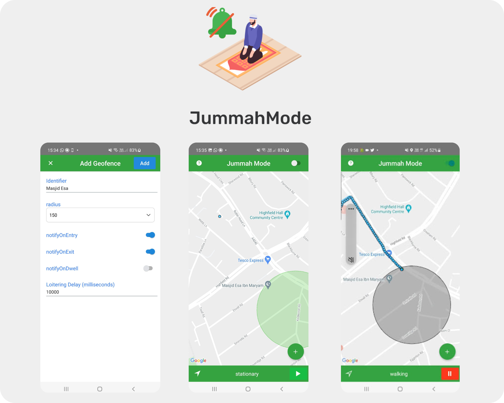

import { Link } from "gatsby"

## Smart Prayer Focus App 🕌

A mobile app that automatically silences your phone when you enter a masjid, helping you focus during salah without digital distractions.

### The Solution
- **Automatic Detection**: Uses location services to detect when you enter a masjid
- **Silent Mode**: Automatically silences notifications, calls, and alerts
- **Peace of Mind**: No need to manually manage your device during prayer
- **Community Benefit**: Maintains the tranquil atmosphere for everyone

### Current Status
This project is in the proof-of-concept stage.

[View Proposal](https://docs.google.com/document/d/19VdflAA2pU0uCnqPid2_jdicrGyhZ5dVWGv12KIMUuQ/edit?usp=sharing) 
#

#
 
<Link to="/">Go back to the homepage</Link>
